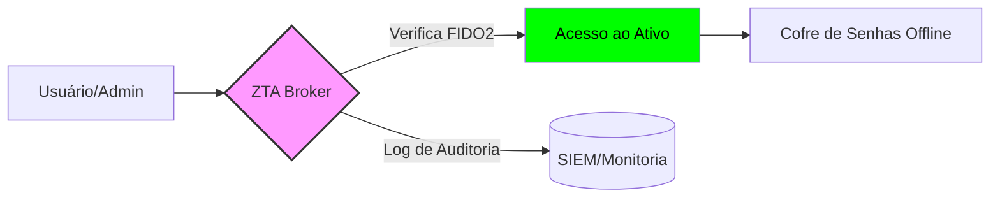

# 🧱 Asset Inventory & Shielding (Fase 02)
**ID:** LR-2026-004 | **Status:** 🟡 EM ANDAMENTO | **Nível:** Arquitetura Zero-Trust

---

## 0. Visão Geral
Após a redução da superfície de ataque (ASR) na Fase 01, esta etapa foca na **Blindagem de Ativos Remanescentes**. O objetivo é garantir que os ativos críticos que precisam permanecer ativos (E-mail profissional, GitHub, LinkedIn) operem sob uma arquitetura de confiança zero, onde cada acesso é verificado e isolado.

---

## 1. Inventário de Ativos Críticos (Survivors)
Lista dos ativos que sobreviveram ao *decommissioning* e que agora recebem a camada de proteção reforçada:

| Categoria | Ativo | Finalidade | Critério de Proteção |
| :--- | :--- | :--- | :--- |
| **Identidade** | E-mail Principal | Comunicação | MFA FIDO2 + PGP |
| **Código** | GitHub / GitLab | Portfólio / Lab | Assinatura de Commits (SSH/GPG) |
| **Infra** | Workstation (Linux) | Lab de Cyber | Kernel Hardening + Full Disk Encryption |
| **Rede** | Domínio Profissional | Portfólio | DNS Shielding + Proxy (Cloudflare) |

---

## 2. Estratégias de Blindagem (Shielding)

### 🛡️ Camada 01: DNS & Traffic Shielding
Utilizamos técnicas de **DNS Filtering** para impedir o rastreamento (fingerprinting) de rede:
* **Controle:** Implementação de DNS over HTTPS (DoH) via Quad9/Cloudflare.
* **Técnica D3FEND:** *Network Traffic Filtering*.
* **Objetivo:** Impedir que o atacante identifique a infraestrutura através de consultas DNS em texto claro.

### 🛡️ Camada 02: Kernel & OS Hardening
Para o laboratório físico/virtual, aplicamos políticas de endurecimento do sistema:
* **Ação:** Desativação de portas USB não utilizadas, enforcement de SELinux/AppArmor e criptografia total de disco (LUKS).
* **Técnica D3FEND:** *Platform Hardening*.

---

## 3. Fluxo de Acesso Zero-Trust (Visual)

---

---

## 4. Checklist de Blindagem (Progress)

- [x] **Identidade:** Migração para MFA Físico (FIDO2).
- [x] **Comunicação:** Implementação de Aliases para serviços diferentes para mitigar correlação de dados.
- [ ] **Rede:** Configuração de Proxy Reverso para ocultar IP real (Em progresso).
- [ ] **Código:** Configuração de assinaturas GPG para garantir a integridade e não-repúdio dos repositórios.

---

## 5. Próximos Passos
A finalização deste documento ocorrerá após a validação rigorosa dos logs de acesso e a realização de um teste de intrusão interna (**Internal PenTest**) para validar a eficácia das novas barreiras de segurança.

---
[⬅️ Voltar ao Dashboard](./README.md)
