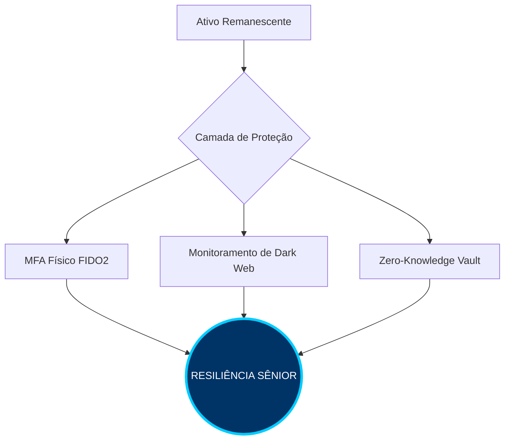

# 🔐 Hardening & Continuous Monitoring Policy
**ID:** HM-2026-001 | **Status:** Ativo | **Nível de Proteção:** Tier 3 (High)

---

## 1. Escopo de Blindagem
Após a redução da superfície de ataque (Fase 01), este documento estabelece os controles de segurança aplicados aos ativos remanescentes para garantir persistência defensiva e detecção precoce.

---

## 2. Implementação de Identity Hardening

### 🔑 Autenticação de Fator Múltiplo (D3-OTAD)
Para eliminar vetores de **SIM Swap** e **Phishing de Proxy**, estabelecemos a transição para métodos de autenticação resistentes a interceptação:
* **Fator Primário:** Hardware Security Keys (**FIDO2/WebAuthn** - Yubikey/Titan).
* **Fator de Backup:** Provedores TOTP (Aegis/Authy) com backups criptografados offline.
* **Diretriz:** Desativação total de SMS e E-mail como métodos de recuperação/MFA em todos os serviços críticos.

### 🛡️ Gestão de Segredos (Secrets Management)
* **Cofre de Senhas:** Migração para arquitetura *Zero-Knowledge* (Bitwarden/KeePassXC).
* **Política de Entropia:** Senhas geradas via CSPRNG com mínimo de 32 caracteres, incluindo caracteres especiais e alfanuméricos aleatórios.

---

## 3. Vigilância Ativa e Monitoramento (D3-LTA)

A defesa passiva foi substituída por um modelo de monitoramento contínuo da Pegada Digital:

### 🕵️ Monitoramento de Exposição de PII
Configuração de sentinelas para detectar vazamentos de dados em tempo real:
* **Integrations:** Webhooks vinculados ao *Have I Been Pwned* (Domain Search) e *Google Dark Web Report*.
* **Ação Automática:** Em caso de "Hit" (detecção), o protocolo de Resposta a Incidentes (IR) é disparado imediatamente.

### 🔍 Auditoria de Indexação (Anti-OSINT)
Varreduras trimestrais para garantir o "Direito ao Esquecimento":
| Ferramenta/Query | Foco Técnico | Frequência |
| :--- | :--- | :--- |
| `Google Dorks` | Identificar cache residual ou novos leaks | Mensal |
| `Sherlock/Maigret` | Detectar "Shadow Accounts" criadas por terceiros | Trimestral |
| `Have I Been Pwned` | Monitorar credenciais vinculadas ao domínio | Real-time |

---

## 4. Matriz de Resiliência (Visual)

---

## 5. Protocolo de Resposta a Incidentes (IR)
Caso o monitoramento proativo detecte uma nova exposição ou vazamento de credenciais:

1.  **Rotate:** Rotação imediata da credencial afetada através do cofre de senhas (*Secrets Rotation*).
2.  **Session Kill:** Revogação global de todos os tokens e sessões ativas (**Técnica D3-EAL**).
3.  **Audit:** Análise profunda dos logs de acesso e auditoria para identificar a causa raiz e a origem do *leak*.

---
[⬅️ Voltar ao Dashboard](./README.md) | [Próximo: Post-Mortem ➡️](./POST-MORTEM-03.md)
