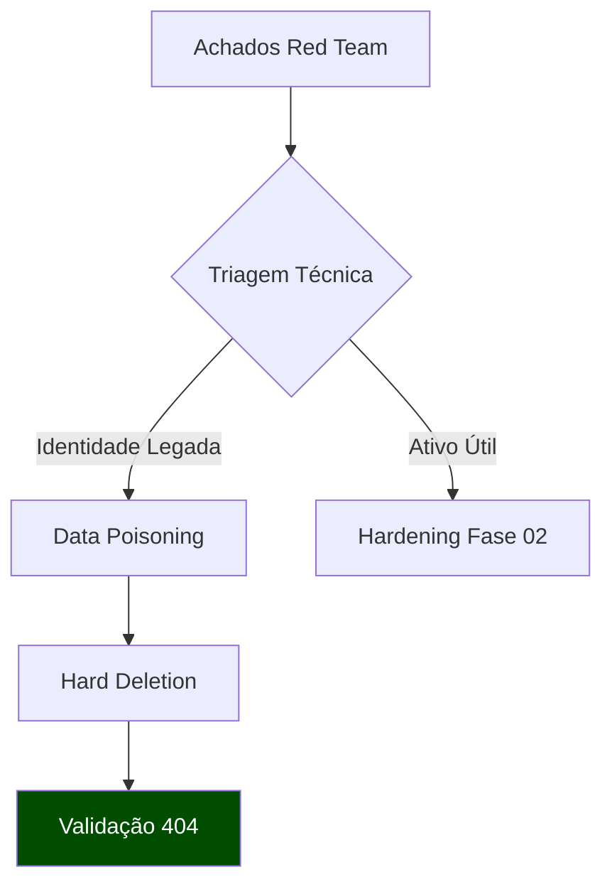

# 🧪 Lab Report: Identity Decommissioning & Surface Reduction
**ID:** LR-2026-001 | **Classificação:** TLP:CLEAR | **Fase:** Blue Team 01

---

## 0. Executive Summary
Relatório de execução da remediação baseada nos achados do **[Red Team OSINT](https://github.com/edenzafire/Red_Team_Repo/tree/main/01_Osint)**. O foco reside na eliminação de identidades legadas e higienização de metadados para neutralizar vetores de ataque identificados na fase ofensiva, aplicando os princípios de **Purple Teaming**.

---

## 1. Análise de Risco (Pre-Remediation)
Aplica-se a técnica **D3-ICA (Identifier Cache Analysis)** do framework MITRE D3FEND para mapear a persistência de identificadores:

| Ativo | Vulnerabilidade | Vetor de Exploração (MITRE) | Impacto Estimado |
| :--- | :--- | :--- | :--- |
| **Meta Accounts** | MFA Legado / Inexistente | [T1589.002] Personal Email | Alto (Pivotagem) |
| **TikTok Asset** | Metadata Leakage | [T1589.003] Artifacts | Médio (Recon) |
| **Old Emails** | Expired Ownership | [T1586.002] Email Accounts | Crítico (ATO) |

---

## 2. Metodologia de Execução (The 3-Step Protocol)

Diferente de uma exclusão comum, aplicamos um protocolo de defesa em profundidade para garantir a inutilização dos dados residuais.

### 🔹 Fase A: Isolation (Isolamento de Identidade)
* **Ação:** Revogação total de permissões OAuth e separação da Central de Contas Meta.
* **Objetivo:** Quebrar a confiança federada para impedir o efeito cascata de um comprometimento.
* **Evidência:** `[Visualizar Log: unlinking-meta.png](./evidences/unlinking-meta.png)`

### 🔹 Fase B: Data Poisoning & Sanitization (Técnica D3-FCA)
* **Ação:** Substituição de PII por dados sintéticos e higienização de arquivos via CLI.
* **Comando Utilizado:**
```bash
# Sanitização de metadados geográfica e de dispositivo
exiftool -all= -Overwrite_Original ./assets_to_delete/

```
---

### 🔹 Fase C: Hard Deletion (Trigger Final)
* **Ação:** Acionamento do protocolo de destruição de dados.
* **Trigger Date:** 01/02/2026 | **Grace Period:** 30 dias.

---

## 3. Fluxo Logístico da Operação


---

## 4. Verificação de Eficácia
Após a execução do protocolo, realizamos uma auditoria de **"Zero Presence"**:

* **Status:** Consultas via ferramentas de OSINT (como Sherlock e Maigret) para os identificadores antigos retornaram `404 Not Found`.
* **Resultado:** Redução estimada de **~85%** da superfície de ataque mapeada inicialmente na fase ofensiva.

---

## 🛠️ Detalhamento por Plataforma
Para visualizar os logs específicos, as configurações de privacidade alteradas e o status de cada rede social, acesse o documento de execução detalhada:

👉 [**Procedimento de Higienização de Redes Sociais (Checklist & Logs)**](./SOCIAL_CLEANUP.md)

---
[⬅️ Voltar ao Dashboard Principal](./README.md)


