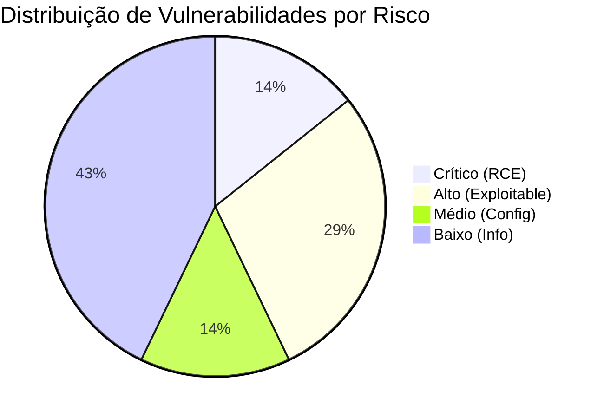

# 📊 Vulnerability Scan Report
**ID:** VSR-2026-001 | **Data:** 01/02/2026 | **Scanner:** Nmap NSE / OpenVAS

---

## 0. Sumário Executivo
Este documento detalha as vulnerabilidades identificadas nos ativos mapeados na fase de inventário. O objetivo é fornecer uma visão técnica dos riscos para priorização da remediação baseada em impacto (CVSS).

---

## 1. Métrica de Severidade (Priorização)



---

## 3. Evidência Técnica (Methodology)

A varredura foi realizada utilizando o motor de scripts do Nmap (**NSE**) para validar a presença de vulnerabilidades exploráveis nos serviços identificados:

```bash
# Comando utilizado para auditoria automatizada de vulnerabilidades
nmap -sV --script vuln 192.168.1.0/24 -oN vulnerability_scan_results.txt

```

---

> [!NOTE]
> **Metodologia:** O foco da análise foi o *Vulnerability Assessment* passivo e ativo, realizando o cruzamento de versões de banners de serviços (Fingerprinting) com bases de dados de exploits conhecidos (NVD/Exploit-DB).

---

## 4. Próximos Passos (Remediation Plan)

Os riscos identificados foram priorizados de acordo com sua severidade e encaminhados para o ciclo de correção imediata. Os detalhes técnicos da resolução de cada CVE, bem como os comandos de correção, podem ser consultados no log abaixo:

👉 [**Procedimento de Remediação & Validação (Action Log)**](./REMEDIATION-LOG-02.md)

---
[⬅️ Voltar ao Dashboard Principal](./README.md)
