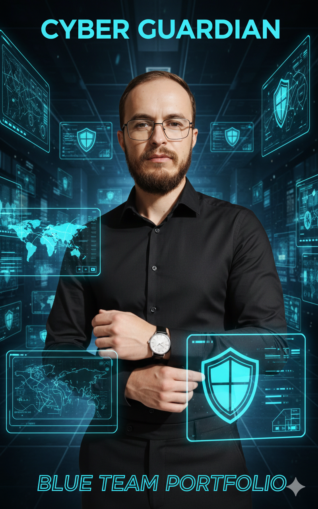

# 🛡️ Portfólio de Blue Team & Defesa Cibernética

> **Nota:** Este portfólio complementa minha atuação em [**Red Team Operations**](https://github.com/edenzafire/Red_Team_Repo). Juntos, eles formam minha base de Purple Teaming.

Bem-vindo ao meu centro de operações de segurança! Este repositório documenta minhas habilidades em **Defesa Ativa**, **Hardening** e **Mitigação de Riscos**. Aqui, o conhecimento ofensivo é a base para construir infraestruturas resilientes.

---

## 👨‍💻 Sobre Mim

Olá! Sou **Éden Zafire**, um entusiasta de cibersegurança focado em transformar vulnerabilidades em perímetros fortificados.

---

## 🛠️ Competências Core & Frameworks

* 🛡️ **Defesa Estratégica (MITRE ATT&CK & D3FEND):** Especialista em converter táticas do **MITRE ATT&CK** em controles de detecção e resposta. Utilizo o framework **D3FEND** para projetar arquiteturas de defesa resilientes baseadas em engenharia de detecção.
* 🔍 **Threat Intelligence:** Monitoramento ativo de indicadores de comprometimento (IoCs) e análise de pegada digital (OSINT) para antecipar movimentos de adversários.
* ⚙️ **Hardening & NIST CSF:** Experiência em blindagem de sistemas Linux/Windows e gestão de identidades (IAM), seguindo as diretrizes do **NIST Cybersecurity Framework** para Identificar, Proteger e Detectar.
* 📋 **Compliance e Governança:** Aplicação de controles baseados na **ISO 27001**, garantindo que a segurança técnica esteja alinhada aos objetivos de negócio e conformidade.
* 🎓 **Evolução Contínua:** Pesquisa constante em metodologias de *Incident Response* e estudos voltados para certificações de defesa cibernética de alto nível.

---

## 🛠️ Stack Tecnológica & Ferramentas

---

  

## 🛡️ Projetos de Resiliência (Do Red ao Blue)

Abaixo, apresento como utilizo a mentalidade ofensiva para implementar contramedidas técnicas:

### 01. Gestão de Pegada Digital (OSINT → Blue)
* **Ação:** Mapeamento de exposição externa e limpeza de metadados.
* **Implementação:** Aplicação de "Direito ao Esquecimento" e monitoramento de *leaks* (Have I Been Pwned/BreachDirectory).
* **Foco:** Privacidade e Redução de Superfície.

### 02. Inventário e Blindagem de Ativos (Recon → Blue)
* **Ação:** Varredura de serviços críticos e fechamento de portas desnecessárias.
* **Implementação:** Configuração de **Host-based Firewalls** para bloquear acessos não autorizados.
* **Foco:** Asset Inventory & Shielding.

### 03. System Hardening (Enumeration → Blue)
* **Ação:** Identificação de protocolos legados e permissões excessivas.
* **Implementação:** Desativação de SMBv1, hardening de kernel e políticas de senhas complexas.
* **Foco:** Princípio do Privilégio Mínimo.

### 04. Segurança de Identidade - IAM (Social Engineering → Blue)
* **Ação:** Prevenção contra roubo de credenciais e acessos indevidos.
* **Implementação:** Deploy de **MFA (2FA)** e processos de *Decommissioning* de contas inativas.
* **Foco:** Identity & Access Management.

### 05. Proteção de Endpoint e Detecção (Exploitation → Blue)
* **Ação:** Bloqueio de execução de payloads e scripts maliciosos.
* **Implementação:** Configuração de defesas de memória (ASLR/DEP) e monitoramento de processos.
* **Foco:** Endpoint Security & EDR.

### 06. Monitoramento de Logs e Forense (Post-Exploitation → Blue)
* **Ação:** Prevenção contra limpeza de rastros e movimentação lateral.
* **Implementação:** Centralização de Logs e uso de **Honeytokens** para detecção precoce.
* **Foco:** SIEM & Incident Response.

---

## 📬 Contato

---

  <em>"A melhor defesa é uma defesa que conhece profundamente o ataque."</em>

